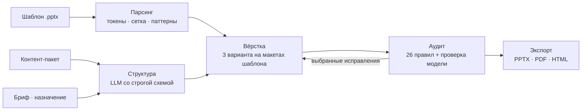

<div align="center">


**Сервис, который читает чужой шаблон как набор правил и собирает по нему готовую презентацию**

[](https://www.python.org)
[](https://fastapi.tiangolo.com)
[](https://react.dev)
[](https://www.typescriptlang.org)
[](#-экспорт)
[](#-тесты)
[](#-о-кейсе)

[Быстрый старт](#-быстрый-старт) · [Архитектура](#-архитектура) · [Деплой](docs/deploy.md) · [API](docs/API.md) · [Аудит](AUDIT.md) · [Модели](MODELS.md) · [Что осталось](docs/gap-analysis.md)

</div>

---

## 📑 Содержание

- [🎯 О кейсе](#-о-кейсе)
- [🚀 Быстрый старт](#-быстрый-старт)
- [🧭 Архитектура](#-архитектура)
- [🔍 Аудит слайдов](#-аудит-слайдов)
- [📤 Экспорт](#-экспорт)
- [🤖 Модели](#-модели)
- [🧪 Тесты](#-тесты)
- [🖼 Эталонные колоды](#-эталонные-колоды)
- [📁 Структура репозитория](#-структура-репозитория)
- [📚 Документация](#-документация)
- [🤝 Разработка](#-разработка)

---

## 🎯 О кейсе

Каждую неделю в компании рождаются десятки презентаций, и каждая проходит один и тот же путь: автор пишет текст, а специалист вручную раскладывает его по корпоративному шаблону. Модели неплохо пишут содержание, но не воспроизводят дизайн-систему.

Сервис закрывает именно этот разрыв: разбирает произвольный шаблон на правила, планирует структуру по брифу, собирает слайды **внутри исходного файла шаблона**, проверяет результат аудитом и выгружает в `.pptx`, `.pdf` и `.html`.

> На финальной защите презентация генерируется по шаблону, которого команда раньше не видела. Поэтому в коде нет ни одного имени макета: всё берётся из загруженного файла.

## 🚀 Быстрый старт

```bash
cp .env.example .env          # адрес модели, токены, порты
docker compose up --build -d
```

- Интерфейс: <http://localhost:3000> — шаблон, бриф, структура, три варианта, аудит и экспорт на одной странице
- API: <http://localhost:8000>, Swagger: <http://localhost:8000/docs>
- Шаблоны из папки `templates/` импортируются при старте (папка не коммитится: файлы принадлежат организаторам)

<details>
<summary><b>Запуск без Docker</b></summary>

**Бэкенд** (нужен LibreOffice для PDF и HTML):

```bash
python -m venv .venv && . .venv/Scripts/activate   # Linux/macOS: . .venv/bin/activate
pip install -r backend/requirements.txt
cd backend && uvicorn designer.server:app --port 8000 --workers 1
```

**Фронтенд:**

```bash
cd frontend
cp .env.example .env          # VITE_API_URL=http://localhost:8000/api/v1
npm ci && npm run dev
```

Без `VITE_API_URL` интерфейс работает в локальном демо-режиме: структура собирается детерминированно, правила шаблона не применяются.

</details>

## 🧭 Архитектура



| Слой | Модуль | Что делает |
|---|---|---|
| **Парсинг** | `backend/designer/parsing.py` | тема и палитра, шрифты и типографическая шкала, рабочая область, поля, направляющие, фон, брендинг каждого слайда |
| **Генерация** | `backend/designer/generation.py` | бриф → структура; промпты лежат файлами в `designer/prompts` с манифестом и SHA-256 |
| **Вёрстка** | `backend/designer/layout.py` | три варианта `classic`, `split`, `focus` из одной структуры, с полями и кеглями самого шаблона |
| **Аудит** | `backend/designer/audit.py` | детерминированные правила, контекстная проверка моделью, выборочные исправления |
| **Экспорт** | `backend/designer/exporting.py` | клонирование слайда-прототипа шаблона, нативные объекты, LibreOffice для PDF и HTML |
| **Интерфейс** | `frontend/src/Studio.tsx` | один экран на весь пайплайн; бренд-система и две темы — в `frontend/src/brand/` |

Главный приём: слайд не рисуется с нуля, а **клонируется из шаблона**. Фон, логотипы, колонтитулы и декор остаются на месте, образцовый текст вычищается, а контент встаёт в рабочую область, рассчитанную по самому файлу.

## 🔍 Аудит слайдов

Аудит — часть пайплайна, а не внешняя проверка. Детерминированные правила (геометрия, поля, выравнивание, пересечения, перекрытие брендинга, кегль вне шкалы, цвет вне палитры, контраст по WCAG, плотность, заглушки, дубли, сверка чисел с источником) дают одинаковый результат на одном и том же слайде. Контекстная проверка выполняется моделью и отмечена отдельной категорией.

Проблемы приходят с координатами и подсветкой на SVG-превью, пользователь выбирает, что исправить, и получает новую ревизию. Полный список кодов и соответствие Приложению 1 ТЗ — в [AUDIT.md](AUDIT.md).

## 📤 Экспорт

| Формат | Как получается |
|---|---|
| `.pptx` | нативные объекты: текстовые блоки, диаграммы с данными, таблицы, фигуры |
| `.pdf` | LibreOffice рендерит тот же PPTX |
| `.html` | автономная страница, собранная из PDF |

Swagger и `openapi.json` — инструмент разработчика: на публичном сервере они закрываются переменной `DESIGNER_DOCS=0`, и обратный прокси их не проксирует.

Каждый экспорт проходит `verify_pptx`: если на слайде нет редактируемых объектов или число слайдов не совпало, генерация падает с ошибкой, а не отдаёт молча картинку.

## 🤖 Модели

Модель не зашита в код. `DESIGNER_LLM_BASE_URL`, `DESIGNER_LLM_MODEL` и `DESIGNER_LLM_API_KEY` задают любого OpenAI-совместимого провайдера: vLLM, инференс VK или облачный API. Допустимы только открытые веса до 35B — например, `gpt-oss-20b` или `Qwen3-32B`. Подробности и ограничения — в [MODELS.md](MODELS.md).

Без модели сервис работает: передайте готовую структуру в `outline`, и вёрстка, аудит и экспорт отработают целиком.

## 🧪 Тесты

```bash
cd backend && pytest -q      # 69 сценариев: парсинг, вёрстка, аудит, фиксы, экспорт, API
cd frontend && npm run build # tsc -b и сборка
```

CI прогоняет оба набора и сборку Docker-образов на каждый push и pull request.

Тестам нужны реальные шаблоны в `templates/` или в папке из `DESIGNER_TEMPLATE_DIR`; без них сценарии с шаблонами пропускаются.

## 🖼 Эталонные колоды

В [samples/](samples/) лежат девять презентаций: три шаблона × три варианта вёрстки,
собранные боевым сервисом на одном и том же материале. Ошибок аудита — ноль, задача
занимает 26–59 секунд. Отчёт и расшифровка предупреждений — в [samples/README.md](samples/README.md).

Повторить сборку на своём сервере:

```bash
python tools/make_samples.py http://<адрес сервиса>
```

Проверить вёрстку на незнакомых шаблонах, без обращения к модели, — план колоды
фиксированный, поэтому различия объясняются шаблоном:

```bash
python tools/bench_templates.py <папка с .pptx> --render out/ --json bench.json
```

## 📁 Структура репозитория

```text
backend/
  designer/
    parsing.py      разбор PPTX: токены, геометрия, паттерны
    generation.py   вызов модели, промпты и их версии
    layout.py       раскладка трёх вариантов
    audit.py        правила, контекстная проверка, исправления
    exporting.py    PPTX, PDF, HTML, проверка нативности
    app.py          HTTP API
    storage.py      SQLite и файлы ревизий
    prompts/        промпты агентов + manifest.json
  tests/            сквозные тесты пайплайна
samples/            девять эталонных колод и материал, из которого они собраны
tools/              сборка эталонов и прогон вёрстки по папке шаблонов
frontend/
  src/Studio.tsx    единый интерфейс: шаблон, бриф, структура, варианты, аудит
  src/brand/        токены, темы, логотип
  src/services/     типизированный клиент API
docs/               API.md, openapi.json, gap-analysis.md
```

## 📚 Документация

| Файл | О чём |
|---|---|
| [ARCHITECTURE.md](ARCHITECTURE.md) | слои, границы, контракты |
| [MODELS.md](MODELS.md) | модели, лицензии, требования, ограничения |
| [AUDIT.md](AUDIT.md) | проверки и их покрытие тестами |
| [docs/API.md](docs/API.md) | контракт HTTP API и сценарий работы |
| [docs/deploy.md](docs/deploy.md) | развёртывание на сервере, переменные окружения, домен |
| [docs/gap-analysis.md](docs/gap-analysis.md) | что закрыто по ТЗ и что осталось |

## 🤝 Разработка

Ветки `feat/*` и `fix/*`, в `master` — через pull request с зелёным CI. Промпты и конфиги моделей живут отдельными файлами, секреты — только в `.env`.

Материалы кейса (шаблоны организаторов, ТЗ, датасет) в репозиторий не коммитятся. Положите их локально в `templates/`.

<details>
<summary><b>Происхождение кода</b></summary>

- Бэкенд вырос из `kiritomp3/vk-presentations`; здесь он вынесен из обёртки `presenton-main` в самостоятельный пакет.
- Фронтенд — из `H10ms/hackaton-frontend`, подключён как `upstream`.

</details>

---

<div align="center">
<sub>© 2026 · Кейс VK Tech «Цифровой дизайнер презентаций» · Лидеры цифровой трансформации</sub>
</div>
