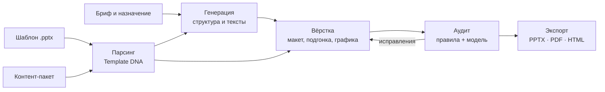
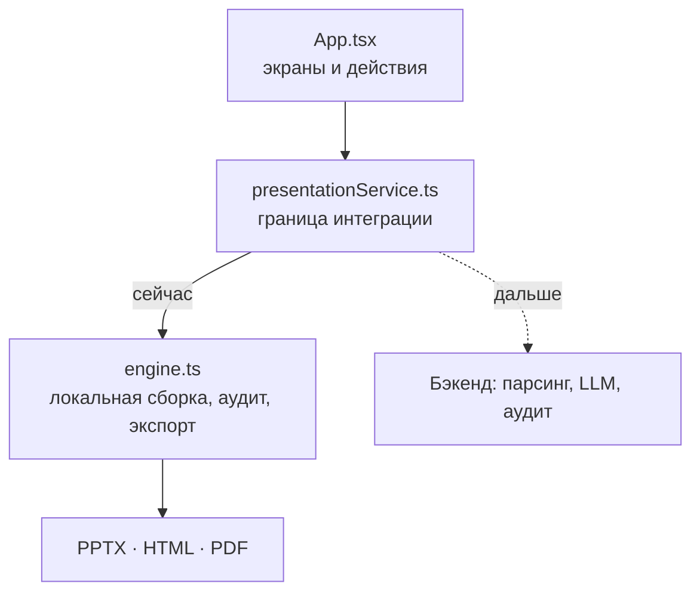

<div align="center">


**Сервис, который читает чужой шаблон как набор правил и собирает по нему готовую презентацию**

[](https://react.dev)
[](https://www.typescriptlang.org)
[](https://vite.dev)
[](#-возможности-прототипа)
[](#-о-кейсе)
[](#-что-уже-есть-и-чего-ещё-нет)

[Быстрый старт](#-быстрый-старт) · [Возможности](#-возможности-прототипа) · [Архитектура](#-архитектура) · [Дорожная карта](#-дорожная-карта-по-тз) · [Подключение бэкенда](#-точка-подключения-бэкенда)

</div>

---

## 📑 Содержание

- [🎯 О кейсе](#-о-кейсе)
- [✨ Возможности прототипа](#-возможности-прототипа)
- [🚀 Быстрый старт](#-быстрый-старт)
- [🧭 Архитектура](#-архитектура)
- [🔌 Точка подключения бэкенда](#-точка-подключения-бэкенда)
- [📊 Что уже есть и чего ещё нет](#-что-уже-есть-и-чего-ещё-нет)
- [🗺 Дорожная карта по ТЗ](#-дорожная-карта-по-тз)
- [📁 Структура проекта](#-структура-проекта)
- [🧱 Материалы кейса](#-материалы-кейса)
- [🤝 Работа с репозиторием](#-работа-с-репозиторием)

---

## 🎯 О кейсе

Каждую неделю в компании рождаются десятки презентаций, и каждая проходит один и тот же путь: автор пишет текст, а специалист вручную раскладывает его по корпоративному шаблону. Модели неплохо пишут содержание, но не воспроизводят дизайн-систему.

**Задача кейса** — закрыть именно этот разрыв: разобрать произвольный шаблон на правила, сгенерировать структуру и тексты по краткому брифу и собрать слайды с графиками, таблицами и иконками, а затем проверить результат аудитом и выгрузить в `.pptx`, `.pdf` и `.html`.

> Ключевое ограничение кейса: на финальной защите презентация генерируется по шаблону, **который команда не видела раньше**. Решение не должно быть заточено под конкретные шаблоны.

## ✨ Возможности прототипа

| Блок | Что уже работает |
|---|---|
| **Бриф** | ввод идеи, готовые примеры, аудитория, цель, количество слайдов |
| **Материалы** | чтение TXT/MD до 2 МБ и 50 000 символов, в том числе перетаскиванием |
| **Шаблоны** | библиотека из трёх шаблонов с метаданными из датасета кейса |
| **Импорт PPTX** | извлечение цветов, шрифта и числа макетов из произвольного файла до 50 МБ, локально в браузере |
| **Структура** | правка заголовков и тезисов, добавление, удаление и перестановка слайдов |
| **Три оформления** | одно содержание в трёх вариантах, миниатюры, редактор текста, полноэкранный просмотр |
| **Проверки** | пустое содержимое, слишком длинный текст, повторы, лишние пробелы |
| **Экспорт** | настоящий PPTX с редактируемыми блоками, автономный HTML, печать в PDF |
| **Библиотека** | сохранение презентаций в localStorage с поиском и удалением |

## 🚀 Быстрый старт

Требуется **Node.js 22.12+** и npm.

```bash
npm ci
npm run dev
```

Vite поднимет интерфейс на `http://127.0.0.1:5173`.

<details>
<summary><b>Сборка и предпросмотр</b></summary>

```bash
npm run build     # tsc -b && vite build → dist/
npm run preview   # локальный предпросмотр собранной версии
```

Ключи и переменные окружения прототипу не нужны: шрифты поставляются с приложением, внешние сервисы во время работы не вызываются.

</details>

## 🧭 Архитектура

Целевой пайплайн из пяти слоёв с жёсткими границами: слои обмениваются только типизированными контрактами.



Текущий прототип закрывает правую часть схемы: интерфейс, структуру, три оформления, локальные проверки и экспорт. Парсинг шаблонов и генерация пока выполняются детерминированно, без моделей.



## 🔌 Точка подключения бэкенда

Вся интеграция проходит через один слой — `src/services/presentationService.ts`:

```ts
PresentationService.createOutline(brief: Brief): Promise<Deck>
```

Сейчас это демонстрационный адаптер поверх `engine.ts`. Чтобы подключить сервер, достаточно заменить его HTTP-клиентом. Доменные типы `Brief`, `Deck`, `Slide`, `Template`, `AuditIssue` лежат в `src/types.ts`.

Следующие серверные операции добавляются в этот же слой:

| Операция | Назначение |
|---|---|
| `importTemplate` | разбор шаблона и возврат его «паспорта» |
| `generate` | запуск генерации колоды, три варианта |
| `jobStatus` | прогресс по этапам пайплайна |
| `audit` | проверки и список найденных проблем |
| `export` | выгрузка в PPTX, PDF, HTML |

## 📊 Что уже есть и чего ещё нет

<details open>
<summary><b>Границы демоверсии</b></summary>

- **ИИ и бэкенд не подключены.** Структура собирается детерминированно из текста пользователя, факты не добавляются.
- **Импорт PPTX берёт метаданные**, а не мастер-слайды, изображения, графики и композиции. Результат использует три собственных макета, всегда 16:9.
- **Аудит локальный:** он не проверяет достоверность, смысл, пересечения объектов и правила композиции.
- **PDF создаётся через печать браузера:** выберите «Сохранить как PDF», включите фоновую графику и отключите колонтитулы.
- **Шрифты:** для точного вида PPTX и HTML шрифт шаблона должен быть установлен у получателя.
- **Данные** хранятся только в текущем браузере и не синхронизируются.

</details>

## 🗺 Дорожная карта по ТЗ

- [x] Интерфейс: бриф, структура, три оформления, библиотека
- [x] Экспорт PPTX нативными объектами, HTML, печать в PDF
- [x] Локальные проверки текста
- [ ] Парсинг шаблона: токены дизайн-системы, сетка, макеты, фиксированные элементы
- [ ] Генерация структуры и текстов моделью с открытыми весами
- [ ] Графики, таблицы, SmartArt и иконки внутри слайда
- [ ] Генерация изображений (задача со звёздочкой для топ-10)
- [ ] Аудит: детерминированные правила и контекстные проверки моделью
- [ ] Версионирование скиллов и агентов, манифест запуска
- [ ] Документы `ARCHITECTURE.md`, `MODELS.md`, `AUDIT.md`

## 📁 Структура проекта

```text
src/
  App.tsx                          экраны и пользовательские действия
  styles.css                       дизайн и адаптивная вёрстка
  simplified.css                   простой главный экран и компактная навигация
  engine.ts                        локальная сборка, PPTX, аудит, экспорт
  types.ts                         доменные типы
  services/presentationService.ts  граница интеграции с бэкендом
  main.tsx                         запуск и локальные шрифты
public/favicon.svg
docs/banner.png
```

## 🧱 Материалы кейса

Метаданные библиотеки прочитаны из датасета: VK Tech (54 слайда / 39 макетов), VK WorkSpace (29 / 15), VK Education (55 / 30). Отдельного контент-пакета в архиве нет, тексты внутри шаблонов не используются как бизнес-факты. Исходные файлы датасета в репозиторий не включены.

## 🤝 Работа с репозиторием

Репозиторий создан копией прототипа `H10ms/hackaton-frontend` и подключён как `upstream`.

```bash
git fetch upstream                 # забрать изменения из исходного репозитория
git merge upstream/master          # влить их в свою ветку
```

<details>
<summary><b>Правила разработки</b></summary>

- Ветки `feat/*` и `fix/*`, в `master` — через pull request.
- Промпты и конфиги моделей хранятся отдельными файлами, а не в коде: этого прямо требует ТЗ.
- Секреты только в `.env`, который не коммитится.
- Перед сдачей: открыть доступ экспертам и проверить его из чужого аккаунта.

</details>

---

<div align="center">
<sub>© 2026 · Кейс VK Tech «Цифровой дизайнер презентаций» · Лидеры цифровой трансформации</sub>
</div>
