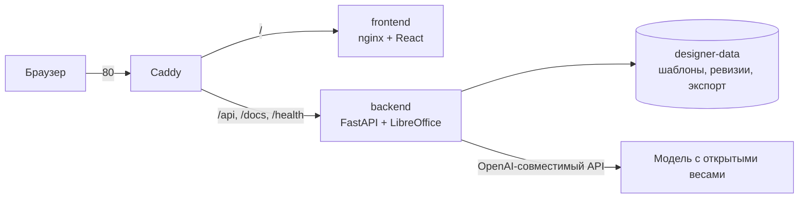

# Развёртывание на сервере

Сервис разворачивается одной командой на любой машине с Docker. Проверялось на Ubuntu 24.04, 2 vCPU / 2 ГБ RAM / 20 ГБ диска (Yandex Cloud Compute).

## Что получается



Наружу открыт только Caddy. Бэкенд и фронтенд портов не публикуют и доступны лишь внутри сети Compose.

## Подготовка сервера

Минимум, который нужен под этот проект:

| Шаг | Зачем |
|---|---|
| swap 2 ГБ | на 2 ГБ RAM сборка фронтенда и LibreOffice иначе падают по OOM |
| UFW: 22, 80, 443 | остальное закрыто |
| fail2ban | защита SSH от перебора |
| unattended-upgrades | security-обновления сами |
| Docker + Compose | запуск сервиса |

> **SSH не трогаем.** Образы облаков уже пускают только по ключу, пароли отключены. Менять порт и криптографию ради мелкого выигрыша не стоит: неудачный перезапуск `sshd` отрезает доступ к серверу. Если такая правка всё же нужна, сначала ставится отложенный откат:
>
> ```bash
> sudo systemd-run --on-active=5min --unit=sshd-rollback \
>   bash -c 'cp -a /root/sshd-backup-*/sshd_config /etc/ssh/ && systemctl restart ssh'
> # проверить вход новым соединением, затем отменить:
> sudo systemctl stop sshd-rollback.timer
> ```

## Запуск

```bash
# на сервере, в корне проекта
cp .env.example .env
nano .env                 # адрес модели, ключ, CORS
bash deploy/deploy.sh
```

`deploy.sh` собирает образы, поднимает стек с продакшн-слоем `deploy/compose.server.yml` и ждёт ответа `/health`
до `HEALTH_TIMEOUT` секунд (по умолчанию 420). Столько нужно, потому что первый старт после смены
`PARSER_VERSION` заново разбирает шаблоны и рендерит их страницы: на 2 vCPU это около двух минут.
Не дождавшись, скрипт печатает последние строки лога бэкенда — причину видно прямо в Actions.

Шаблоны кладутся в `templates/` на сервере: при старте бэкенд импортирует все `.pptx` из этой папки, повтор определяется по SHA-256.

## Переменные окружения

| Переменная | Значение |
|---|---|
| `DESIGNER_LLM_BASE_URL` | адрес OpenAI-совместимого API вместе с `/v1` |
| `DESIGNER_LLM_MODEL` | идентификатор модели у провайдера |
| `DESIGNER_LLM_API_KEY` | ключ провайдера, остаётся на сервере и в браузер не попадает |
| `DESIGNER_CORS_ORIGINS` | адрес, с которого открывают интерфейс |
| `DESIGNER_API_KEY` | необязательный Bearer-токен для API |
| `DESIGNER_DOCS` | `0` на публичном сервере: закрывает Swagger, ReDoc и `openapi.json` |

Пример для Yandex AI Studio (только открытые веса до 35B, как требует ТЗ):

```bash
DESIGNER_LLM_BASE_URL=https://ai.api.cloud.yandex.net/v1
DESIGNER_LLM_MODEL=gpt://<folder_id>/gpt-oss-20b
DESIGNER_LLM_API_KEY=<API-ключ сервисного аккаунта>
```

Ключ выдаётся сервисному аккаунту с ролью `ai.languageModels.user`, область действия ключа — `yc.ai.foundationModels.execute`.

## Автодеплой из GitHub Actions

Каждый push в `master` после зелёного этапа **Tests** (`pytest`, `frontend`, `Integration`; см. [tests.yml](../.github/workflows/tests.yml) и [regression.md](regression.md)) запускает job `deploy` в [ci.yml](../.github/workflows/ci.yml). Job передаёт серверу по SSH только команду `deploy <sha>`, код сервер забирает сам.

1. `~/vk-designer` на сервере — git-клон с read-only deploy-ключом GitHub (`~/.ssh/github_deploy`, прописан в `core.sshCommand`).
2. Ключ Actions привязан в `authorized_keys` к приёмнику [`deploy/ci-receive.sh`](../deploy/ci-receive.sh) через `restrict,command=...`: по этому ключу нельзя получить shell, можно только попросить выкатить коммит.
3. Приёмник делает `git fetch` (три попытки), принимает коммит, только если он входит в `origin/master`, переключает на него рабочую копию и запускает `deploy/deploy.sh`. `.env` и `templates/` лежат в `.gitignore`, их это не задевает.
4. Если сборка или `/health` не прошли, приёмник возвращает прошлый коммит и образы `:prev`. Job падает, в логе видно почему.

Параллельные деплои исключены: `concurrency: production` в Actions и `flock` на сервере.

| Где | Имя | Что |
|---|---|---|
| Secrets | `DEPLOY_SSH_KEY` | приватный deploy-ключ ed25519 |
| Secrets | `DEPLOY_KNOWN_HOSTS` | `ssh-keyscan -t ed25519 <хост>`, чтобы не доверять хосту вслепую |
| Variables | `DEPLOY_HOST`, `DEPLOY_USER` | адрес сервера и пользователь |

Приёмник на сервере лежит вне каталога проекта (`~/vk-designer-ci/receive.sh`), поэтому коммит не может его подменить. После правки `deploy/ci-receive.sh` его переустанавливают вручную:

```bash
ssh <сервер> 'cat > ~/vk-designer-ci/receive.sh' < deploy/ci-receive.sh
```

Пользователь, от которого идёт деплой, должен быть в группе `docker`, а на машине с 2 ГБ RAM нужен swap: без него сборка фронтенда падает по OOM.

> Если на сервере включён fail2ban, подключайтесь с `-o IdentitiesOnly=yes`. Иначе ssh перебирает все ключи из агента и быстро набирает три неудачные попытки, после которых IP банится.

## Ручное обновление и откат

```bash
git pull                                   # или залить архив
bash deploy/deploy.sh                      # пересборка и перезапуск
docker compose -f docker-compose.yml -f deploy/compose.server.yml logs -f backend
```

Данные живут в volume `designer-data` и переживают пересборку. Откат — вернуться на прошлый коммит и снова выполнить `deploy.sh`.

## Домен и HTTPS

Без домена сервис работает по IP на 80 порту. Когда домен появится: направить A-запись на сервер, в `deploy/Caddyfile` заменить `:80` на имя домена — Caddy сам выпустит сертификат Let's Encrypt. В `.env` не забыть поправить `DESIGNER_CORS_ORIGINS`.

## Переключение на VK

Статус: подготовка к подключению. URL, точный ID Qwen 3.8 27b, ключ, лимиты
и фактическое время генерации необходимо подтвердить на доступе организаторов.

1. Сохранить прежние `DESIGNER_LLM_BASE_URL`, `DESIGNER_LLM_MODEL`,
   `DESIGNER_LLM_API_KEY` и дополнить серверный `.env`:

   ```dotenv
   DESIGNER_LLM_PROVIDER=openai
   DESIGNER_VK_BASE_URL=<выданный базовый URL с версионным префиксом, без /chat/completions>
   DESIGNER_VK_MODEL=<точный ID из API VK>
   DESIGNER_VK_API_KEY=<ключ VK>
   DESIGNER_VK_MAX_TOKENS=14000
   DESIGNER_VK_TIMEOUT=150
   DESIGNER_VK_JSON_MODE=1
   ```

   Три последние настройки — начальные значения клиента. Сверить с документацией
   выданного API: окно контекста должно вместить промпт, материалы и ответ;
   при необходимости уменьшить `DESIGNER_CONTEXT_CHARS` и лимит ответа.
   Для VLM на прежнем провайдере явно задать её URL и ключ в `DESIGNER_VLM_*`.

2. Изменить одну строку на `DESIGNER_LLM_PROVIDER=vk`. Пересобрать backend при
   первом обновлении кода, затем пересоздать контейнер с переменными из `.env`:

   ```bash
   docker compose -f docker-compose.yml -f deploy/compose.server.yml up -d --build --force-recreate backend
   ```

   Обычный `restart` не перечитывает окружение. Ключ остаётся только на сервере.

3. На сервере из корня проекта запустить проверку в окружении backend.
   В образе нет каталога `tools`, поэтому передать скрипт через stdin;
   для короткой проверки API дополнительных аргументов не нужно:

   ```bash
   docker compose -f docker-compose.yml -f deploy/compose.server.yml exec -T backend python - < tools/check_inference.py
   ```

   Для полного прогона удобнее рабочая копия с установленными
   `backend/requirements.txt` и теми же переменными в окружении процесса:

   ```bash
   python tools/check_inference.py --service http://localhost:8000 --template-id <ID_загруженного_шаблона>
   ```

   Скрипт сам `.env` не загружает. Запускайте полную проверку против тестового
   экземпляра, настроенного на VK: она загружает материал из `samples/source/`
   и сохраняет три новые презентации в сервисе. При защите API экспортируйте
   `DESIGNER_API_KEY`. Проверить также глазами полученные PPTX. Сохранить вывод
   с временем, job ID, коммитом и датой в `docs/worklog/`; не прикладывать ключи.

4. При 401/403 проверить ключ и доступ; при 404 — базовый URL и ID модели;
   при 400/422 — поля и лимиты, отдельно поддержку JSON mode. При 429 проверить
   квоту, при таймауте — задержку инференса и объём ответа. Не считать короткий
   JSON-ответ подтверждением полной генерации за пять минут.

Откат: вернуть `DESIGNER_LLM_PROVIDER=openai` и повторить команду пересоздания
backend. Исходные URL, модель и ключ сохраняются. Не переключать рабочий стенд
на финале до успешного полного прогона; текущая подготовка не подтверждает
фактическую доступность API VK.
