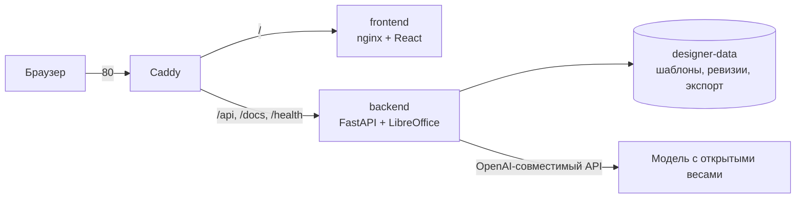

# Развёртывание на сервере

Сервис разворачивается одной командой на любой машине с Docker. Проверялось на Ubuntu 24.04, 2 vCPU / 2 ГБ RAM / 20 ГБ диска (Yandex Cloud Compute).

## Что получается



Наружу открыт только Caddy. Бэкенд и фронтенд портов не публикуют и доступны лишь внутри сети Compose.

## Подготовка сервера

Минимум, который нужен под этот проект:

| Шаг | Зачем |
|---|---|
| swap 2 ГБ | на 2 ГБ RAM сборка фронтенда и LibreOffice иначе падают по OOM |
| UFW: 22, 80, 443 | остальное закрыто |
| fail2ban | защита SSH от перебора |
| unattended-upgrades | security-обновления сами |
| Docker + Compose | запуск сервиса |

> **SSH не трогаем.** Образы облаков уже пускают только по ключу, пароли отключены. Менять порт и криптографию ради мелкого выигрыша не стоит: неудачный перезапуск `sshd` отрезает доступ к серверу. Если такая правка всё же нужна, сначала ставится отложенный откат:
>
> ```bash
> sudo systemd-run --on-active=5min --unit=sshd-rollback \
>   bash -c 'cp -a /root/sshd-backup-*/sshd_config /etc/ssh/ && systemctl restart ssh'
> # проверить вход новым соединением, затем отменить:
> sudo systemctl stop sshd-rollback.timer
> ```

## Запуск

```bash
# на сервере, в корне проекта
cp .env.example .env
nano .env                 # адрес модели, ключ, CORS
bash deploy/deploy.sh
```

`deploy.sh` собирает образы, поднимает стек с продакшн-слоем `deploy/compose.server.yml` и ждёт ответа `/health`.

Шаблоны кладутся в `templates/` на сервере: при старте бэкенд импортирует все `.pptx` из этой папки, повтор определяется по SHA-256.

## Переменные окружения

| Переменная | Значение |
|---|---|
| `DESIGNER_LLM_BASE_URL` | адрес OpenAI-совместимого API вместе с `/v1` |
| `DESIGNER_LLM_MODEL` | идентификатор модели у провайдера |
| `DESIGNER_LLM_API_KEY` | ключ провайдера, остаётся на сервере и в браузер не попадает |
| `DESIGNER_CORS_ORIGINS` | адрес, с которого открывают интерфейс |
| `DESIGNER_API_KEY` | необязательный Bearer-токен для API |
| `DESIGNER_DOCS` | `0` на публичном сервере: закрывает Swagger, ReDoc и `openapi.json` |

Пример для Yandex AI Studio (только открытые веса до 35B, как требует ТЗ):

```bash
DESIGNER_LLM_BASE_URL=https://ai.api.cloud.yandex.net/v1
DESIGNER_LLM_MODEL=gpt://<folder_id>/gpt-oss-20b
DESIGNER_LLM_API_KEY=<API-ключ сервисного аккаунта>
```

Ключ выдаётся сервисному аккаунту с ролью `ai.languageModels.user`, область действия ключа — `yc.ai.foundationModels.execute`.

## Автодеплой из GitHub Actions

Каждый push в `master` после зелёных `backend`, `frontend` и `images` запускает job `deploy` в [ci.yml](../.github/workflows/ci.yml):

1. Actions собирает архив коммита (`git archive`, без `samples/`) и передаёт его по SSH командой `deploy <sha>`.
2. На сервере deploy-ключ привязан в `authorized_keys` к приёмнику [`deploy/ci-receive.sh`](../deploy/ci-receive.sh) через `restrict,command=...`: по этому ключу нельзя получить shell, можно только передать релиз.
3. Приёмник распаковывает релиз в `~/vk-designer-ci/releases/<sha>`, синхронизирует код в `~/vk-designer` (не трогая `.env`, `templates/`, `out/`), запускает `deploy/deploy.sh` и пишет коммит в `.deployed-sha`.
4. Если сборка или `/health` не прошли, приёмник возвращает образы `:prev` и код прошлого релиза. Job падает, в логе видно почему.

Параллельные деплои исключены: `concurrency: production` в Actions и `flock` на сервере.

| Где | Имя | Что |
|---|---|---|
| Secrets | `DEPLOY_SSH_KEY` | приватный deploy-ключ ed25519 |
| Secrets | `DEPLOY_KNOWN_HOSTS` | `ssh-keyscan -t ed25519 <хост>`, чтобы не доверять хосту вслепую |
| Variables | `DEPLOY_HOST`, `DEPLOY_USER` | адрес сервера и пользователь |

Приёмник на сервере лежит вне каталога проекта (`~/vk-designer-ci/receive.sh`), поэтому коммит не может его подменить. После правки `deploy/ci-receive.sh` его переустанавливают вручную:

```bash
ssh <сервер> 'cat > ~/vk-designer-ci/receive.sh' < deploy/ci-receive.sh
```

> На сервере fail2ban банит IP после трёх неудачных входов. Подключайтесь с `-o IdentitiesOnly=yes`, иначе ssh перебирает все ключи из агента и быстро набирает эти три попытки.

## Ручное обновление и откат

```bash
git pull                                   # или залить архив
bash deploy/deploy.sh                      # пересборка и перезапуск
docker compose -f docker-compose.yml -f deploy/compose.server.yml logs -f backend
```

Данные живут в volume `designer-data` и переживают пересборку. Откат — вернуться на прошлый коммит и снова выполнить `deploy.sh`.

## Домен и HTTPS

Без домена сервис работает по IP на 80 порту. Когда домен появится: направить A-запись на сервер, в `deploy/Caddyfile` заменить `:80` на имя домена — Caddy сам выпустит сертификат Let's Encrypt. В `.env` не забыть поправить `DESIGNER_CORS_ORIGINS`.
